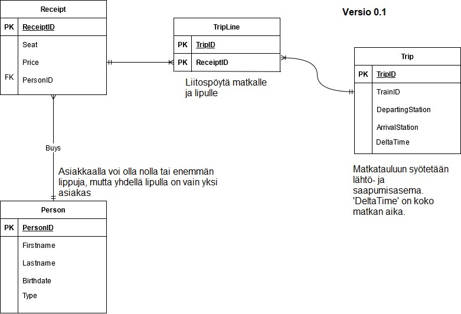

# Projektin dokumentaatio

  

## Sisällysluettelo

1. [Tietokannan suunnittelu](#tietokannan-suunnittelu)  
2. [EER-kaavio](#eer-kaavio)  

## Tietokannan suunnittelu

**KÄSITEANALYYSI**  

Projektin vaatimusmäärittelystä voin aloittaa käsitteiden ja niiden ominaisuuksien tunnistamisen. Kirjaan yleisimmät käsitteet ja ominaisuudet ylös ja erittelen ne seuraavaa vaihetta varten.  

**KÄSITTEET**  

* Matka
  * Saapumisasema
  * Lähtemisasema
  * Matkan kesto
  * Matkan pituus
  * Juna

* Asiakas
  * Nimi
  * Sukupuoli
  * Syntymäpäivä

* Lippu
  * Asiakas(FK?)
  * Hinta
  * Istumapaikka

* Rahtitavara
  * Kategoria
  * Tyyppi
  * Määrä
  * Matka(FK?)

* Juna
  * Yhtiö(FK?)
  * Tunniste(PK?)
  * Istumapaikkamäärä

* Yhtiö
  * Nimi

* Huoltoraportti
  * Juna(FK?)
  * Päivämäärä
  * Tyyppi
  * Tila
  * Muu kommentti  

Käsitteiden ja niiden ominaisuuksien tunnistamisen jälkeen voin alkaa suunnittelemaan miten projektin vaatimusmäärittelyssä kysytty tietokanta luodaan. Projekti on laaja, joten puran tietokannan toiminnot pienempiin osiin joille luon käsiteanalyysin yksi kerrallaan.    

Yksi tärkeimmistä ominaisuuksista on matkalippujen osto, joten aloitan suunnittelun tästä. Tietokanta tarvitsee tätä varten 'Henkilö', 'Lippu' ja 'Matka' -taulun. Kuvaan näiden taulujen relaatioita ja attribuutteja näin:  

  

Lipun ja matkan välille syntyy moni-moneen relaatio, joten tämä puretaan liitostaululla 'TripLine'.  
Jokaisella junamatkalla on oltava vähintään yksi henkilökunnan jäsen, joten 'Person' -tauluun joudutaan lisäämään 'Type' -attribuutti joka kertoo jos henkilö on asiakas tai osa henkilökuntaa.  

Näillä tauluilla ja relaatioilla voidaan käsitellä matkalippuja, asiakkaita ja henkilöstöä. Seuraavaksi suunnittelen junien, rahtien ja yhtiöiden välistä relaatiota:  

  

Näiden taulujen lisääminen ei ollut lopulta vaikeaa, sillä ne sulautuivat hyvin nykyiseen "Trip" -tauluun.  

Tässä vaiheessa huomasin merkittävän ongelman: Henkilöstön ja asiakkaiden erottelu tulee olemaan hankalaa nykyisessä muodossa. 'Person' -tauluun pitäisi lisätä vain henkilöstöä varten palkka, asema ja heille pitäisi luoda oma "lippu" jokaista matkaa varten. Pitkän suunnittelun jälkeen päätin ratkaista tämän ongelman luomalla liitostaulun 'Trip', ja 'Person' -taulun välille. Se toimisi kuten tyypillinen liitostaulu, mutta siihen lisätään henkilökuntajäsenen arvo ja palkka.  

Tämän lisäksi luon uuden "MaintenanceReport" -taulun jolla voidaan mitata junien huoltotilannetta ja raportteja. Hion taulujen attribuuttien nimiä tarkemmaksi ja lisäsin niitä tarvittaessa vaatimusmäärittelyn mukaisesti:  

  

Tällä käsitemallilla pitäisi pystyä suorittamaan vaatimusmäärittelyssä esitetyt ominaisuudet.  
Kun käsitemalli on luotu, voin aloittaa EER-kaavion suunnittelemisen 'MySQL WorkBench' -ohjelmistolla.

### EER-Kaavio

**EER-KAAVIO**  

Käsiteanalyysin jälkeen voin rakentaa EER-kaavion. Koska käsiteanalyysi tehtiin hyvin kattavaksi, niin EER-kaavion mallentaminen tästä ei ollut huomattavan ongelmallista.  

  

**RAJOITUKSET**  
- Juna kuuluu vain yhdelle yhtiölle.  
- Lipulla on vain yksi henkilö.  
- Junamatkalla on vain yksi juna.  
- Rahtitavaralla on vain yksi matka.  
- Huoltoraportilla on vain yksi juna.  

**SUHTEET**  
- Junalla voi olla monta matkaa, mutta matkalla on vain yksi juna.  
- Matkalla voi olla monta eri rahtitavaraa.  
- Junalla voi olla monta huoltoraporttia, mutta huoltoraportilla on vain yksi juna.  
- Lipulla voi olla monta matkaa. (Junien vaihdot)  
- Yhdellä asiakkaalla voi olla monta lippua.  
- Junalla on vain yksi yhtiö, mutta yhtiöllä voi olla monta junaa.
