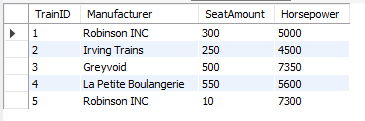

# Tietokannan optimointi

**NÄKYMÄT**  

Luodaan näkymä, jolla voidaan katsella kaikki junat ja niiden tekniset tiedot nopeasti:  

```
CREATE VIEW Trains
AS SELECT TrainID, Manufacturer, SeatAmount, Horsepower FROM train;

-- Käyttö

SELECT * FROM Trains;
```

  

**INDEKSOINTI**  

Luodaan tietokantaan seuraaville tauluille ja niiden sarakkeille indeksit suorituskyvyn parantamista varten.  

* 'Freight' -taulu  

```
CREATE INDEX i_freightCategory ON freight(Category);
CREATE INDEX i_freightType ON freight(Type);
CREATE INDEX i_freightID ON freight(freightID);
```  

* 'Person' -taulu  

```
CREATE INDEX i_personID ON Person(PersonID);
CREATE INDEX i_personFirsname ON Person(Firstname);
CREATE INDEX i_personLastname ON Person(Lastname);
```  

* 'Receipt' -taulu  

```
CREATE INDEX i_receiptID ON receipt(ReceiptID);
CREATE INDEX i_receiptSeat ON receipt(Seat);
CREATE INDEX i_receiptPrice ON receipt(Price);
```  

* 'Trip' -taulu  

```
CREATE INDEX i_tripID ON trip(TripID);
CREATE INDEX i_tripEstimatedTime ON trip(EstimatedTime);
CREATE INDEX i_tripTotalDistance ON trip(TotalDistance);
CREATE INDEX i_tripArrivalStation ON trip(ArrivalStation);
CREATE INDEX i_tripDepartingStation ON trip(DepartingStation);
```  

* 'train' -taulu  

```
CREATE INDEX i_trainID ON train(TrainID);
```  

**TRANSAKTIOT**  

Transaktiota pitää käyttää lipunoston yhteydessä. Tämä tehdään siksi, että tietojen tallentuminen onnistuisi ongelmitta.  

Esimerkki:  

```
BEGIN;

INSERT INTO receipt (ReceiptID, Seat, Price, Person_PersonID) VALUES (7, '5-21', 42, 2);
INSERT INTO trip_has_receipt (Trip_TripID, Receipt_ReceiptID) VALUES (2, 7);

COMMIT;
```

**TRIGGERIT**  

Luon triggerin seuraaville tauluille alla mainituilla ehdoilla:  

* Receipt  
  * Price (Price > 0)  

Tällä varmistetaan, että matkalipun hinta ei ole negatiivinen.  
```
DELIMITER $$

CREATE TRIGGER Receipt 
BEFORE INSERT ON Receipt 
FOR EACH ROW 
BEGIN IF!(NEW.Price > 0) THEN 
    CALL `ERROR: Price cannot be lower than 0!`; 
END IF; 
END$$

DELIMITER ;
```  

**TRIGGERIN TESTAUS**  

```
MariaDB [rautatiejarjestelma_db]> INSERT INTO receipt (ReceiptID, Seat, Price, Person_PersonID) VALUES(8, '2-14', 0, 1);
ERROR 1305 (42000): PROCEDURE rautatiejarjestelma_db.ERROR: Price cannot be lower than 0! does not exist

MariaDB [rautatiejarjestelma_db]> INSERT INTO receipt (ReceiptID, Seat, Price, Person_PersonID) VALUES(8, '2-14', 35, 1);
Query OK, 1 row affected (0.002 sec)
```  


