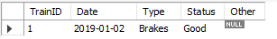
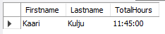

# SQL kyselyt

* **Hae tietyn yhtiön kaikki junat.** (Rogersound)  
```
SELECT train.TrainID, train.Manufacturer, train.SeatAmount, train.Horsepower FROM train
INNER JOIN  company ON train.Company_CompanyID = company.CompanyID
WHERE company.Name = 'Rogersound';
```  
  

* **Hae tietyn henkilön kaikki liput.** (Salla Holappa)  

```
SELECT p.PersonID, p.Firstname, p.Lastname, r.Seat, r.Price FROM person p
INNER JOIN receipt r ON p.PersonID = r.Person_PersonID
WHERE p.Firstname = 'Salla' AND p.Lastname = 'Holappa';
``` 

  

* **Hae tietyn junan kaikki huoltoraportit.** (Juna ID 1)  

```
SELECT train.TrainID, Date, Type, Status, Other FROM maintenancereport
INNER JOIN train ON train.TrainID = Train_TrainID
WHERE train.TrainID = '1';
```  
  

* **Hae tietyn junan kaikki huoltoraportit tietyltä aikaväliltä.** (Juna ID 1, aikaväli 2018-02-01 ja 2021-02-28)  

```
SELECT train.TrainID, m.Date, m.Type, m.Status, m.Other FROM maintenancereport m
INNER JOIN train ON train.TrainID = m.Train_TrainID
WHERE train.TrainID = 1 AND (m.Date BETWEEN CAST('2018-02-01' AS DATE) AND CAST('2021-02-28' AS DATE));
```  

  

* **Hae tietyn junan matkatunnit ja niiden keskiarvo.** (Juna ID 1)  

```
SELECT train.TrainID, SEC_TO_TIME(AVG(TIME_TO_SEC(trip.EstimatedTime))) AS AverageTripHours, SEC_TO_TIME(SUM(TIME_TO_SEC(trip.EstimatedTime))) AS TotalTripHours FROM trip
INNER JOIN train ON train.TrainID = trip.Train_TrainID
WHERE train.TrainID = 1;
```  

  

* **Hae tietyn matkan kaikki matkustajat** (Matka ID 1)  

```
SELECT p.Firstname, p.Lastname, p.TYPE, r.Seat, r.Price FROM trip
INNER JOIN trip_has_receipt tr ON tr.Trip_TripID = TripID
INNER JOIN Receipt r ON r.ReceiptID = tr.Receipt_ReceiptID
INNER JOIN Person p ON p.PersonID = r.Person_PersonID
WHERE TripID = 1;
```  

  

* **Hae tietyn matkan kaikki henkilökunta** (Matka ID 1)  

```
SELECT p.Firstname, p.Lastname, p.TYPE, s.Rank, s.Salary FROM trip
INNER JOIN staff s ON s.Trip_TripID = TripID
INNER JOIN person p ON p.PersonID = s.Person_PersonID
WHERE TripID = 1;
```  
  

* **Hae tietyn henkilökuntajäsenen työtunnit** (Kaari Kulju)  

```
SELECT p.Firstname, p.Lastname, SEC_TO_TIME(SUM(TIME_TO_SEC(EstimatedTime))) as TotalHours  FROM trip
INNER JOIN staff s ON s.Trip_TripID = TripID
INNER JOIN person p ON p.PersonID = s.Person_PersonID
WHERE p.Firstname = 'Kaari' AND p.Lastname = 'Kulju';
```  
  

* **Hae tietyn matkan rahtitavarat** (Matka ID 5)  

```
SELECT tr.TrainID, f.Category, f.Type, f.Amount, f.TotalWeight FROM trip
INNER JOIN freight f ON f.Trip_TripID = TripID
INNER JOIN train tr ON tr.TrainID = Train_TrainID
WHERE f.Trip_TripID = 5;
```  

  

* **Hae tietyn junan kaikkien kuljetettujen rahtitavaroiden paino ja niiden keskiarvo** (Juna ID 4)  

```
SELECT tr.TrainID, AVG(f.TotalWeight) AS AVG_Weight, SUM(f.TotalWeight) AS SUM_TotalWeight FROM trip
INNER JOIN freight f ON f.Trip_TripID = TripID
INNER JOIN train tr ON tr.TrainID = Train_TrainID
WHERE tr.TrainID = 4;
```  

  

* **Hae tietylle asemalle tullut rahtitavara, yhtiö ja sen juna joka toimitti kyseisen rahtitavaran.** (Oulu)  

```
SELECT c.Name AS Delivering_Company,tr.TrainID, f.Category, f.Type, f.Amount, f.TotalWeight FROM trip
INNER JOIN freight f ON f.Trip_TripID = TripID
INNER JOIN train tr ON tr.TrainID = Train_TrainID
INNER JOIN company c ON c.CompanyID = tr.Company_CompanyID
WHERE ArrivalStation = 'Oulu';
```

  
HUOM! Jos haluaa tietää mitä rahtia on lähtenyt joltakin asemalta, pitää vain vaihtaa 'ArrivalStation' 'DepartingStation'.